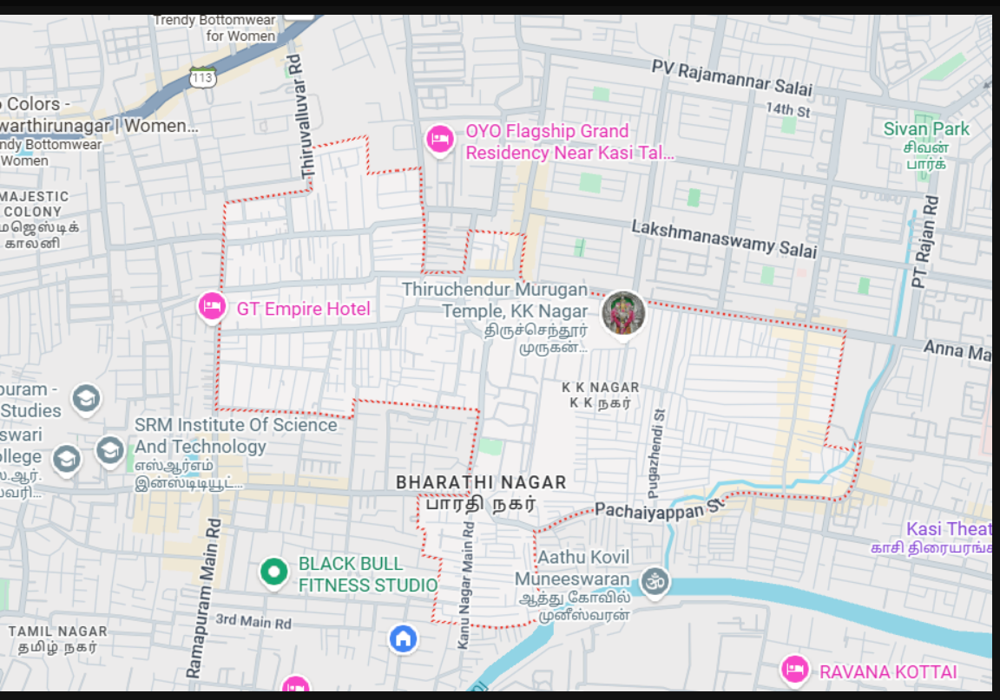

# Ex04 Places Around Me
## Date: 12.12.25

## AIM
To develop a website to display details about the places around my house.

## DESIGN STEPS

### STEP 1
Create a Django admin interface.

### STEP 2
Download your city map from Google.

### STEP 3
Using ```<map>``` tag name the map.

### STEP 4
Create clickable regions in the image using ```<area>``` tag.

### STEP 5
Write HTML programs for all the regions identified.

### STEP 6
Execute the programs and publish them.

## CODE

'''
DOCTYPE html
<html lang="en">
<head>
    <meta charset="UTF-8">
    <meta name="viewport" content="width=device-width, initial-scale=1.0">
    <title>home page</title>
</head>
<body>
    <!-- Image Map Generated by http://www.image-map.net/ -->


<map name="image-map">
    <area target="" alt="fitnessstudio" title="fitnessstudio" href="fitnessstudio.html" coords="233,472,439,555" shape="rect">
    <area target="" alt="sivanpark" title="sivanpark" href="sivanpark.html" coords="856,114,60" shape="circle">
    <area target="" alt="GThotel " title="GThotel " href="GThotel.html" coords="171,225,388,226,371,330,151,348" shape="poly">
</map>
</body>

</html>'''

## OUTPUT



## RESULT
The program for implementing image maps using HTML is executed successfully.
